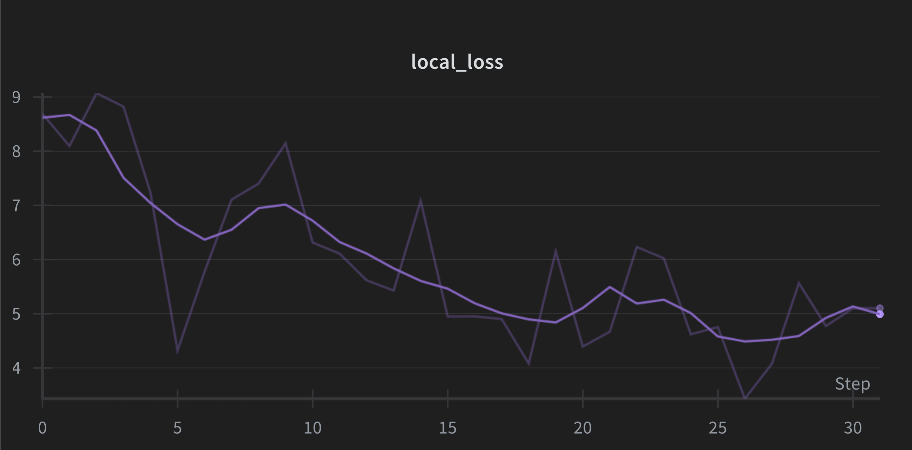

This repository is an unofficial attempt to recreate the core ideas of **[DeepSeek-OCR](https://github.com/deepseek-ai/DeepSeek-OCR)**.

<p align="center">
  
</p>

## Training Loss (W&B Logs)

<p align="center">
  
</p>

## Training

To train the model, simply run:

```
python train.py
```

Modify the configuration values directly inside `train.py`.  
(CLI arguments will be added soon.)

## Text Generation

You can generate text using:

```python
generate_text(
    deep_encoder   = deep_encoder,
    gpt2           = deep_decoder,
    projector      = deep_encoder.projector,
    tokenizer      = tokenizer,
    image          = next(iter(val_loader))['images'][0],
    prompt         = "<image>\n",
    max_new_tokens = max_new_tokens,
    temperature    = 1.5,
    top_k          = 50,
    device         = device
)
```